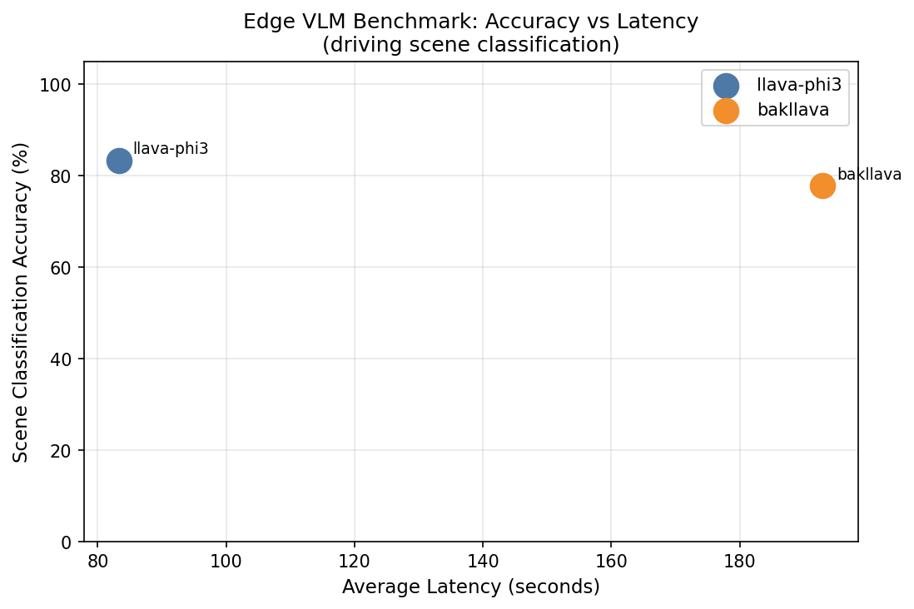
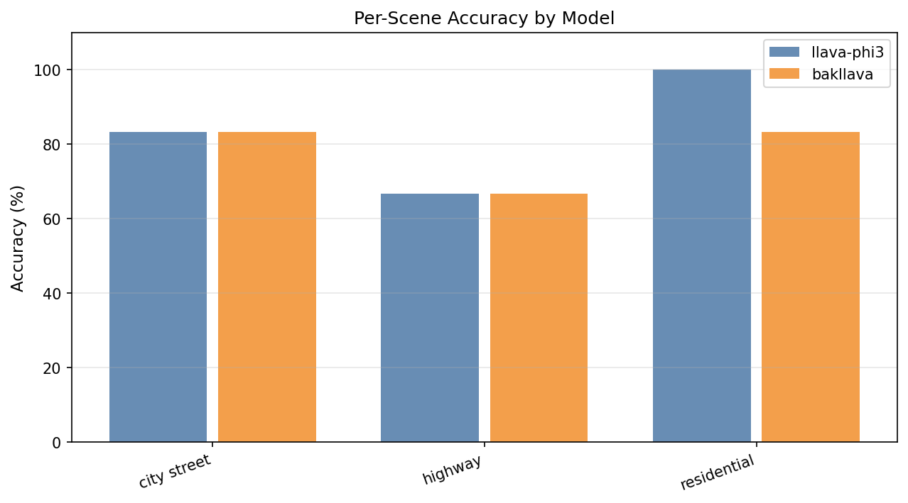

# edge-vlm-bench

Benchmark of small vision-language models (VLMs) on driving-scene classification — evaluating accuracy vs. latency tradeoffs relevant to edge AI deployment (e.g., Ambarella, NVIDIA Jetson, Raspberry Pi).

## Why this matters

Companies like Ambarella build AI chips for embedded cameras in autonomous vehicles. A core engineering question before deploying any VLM on constrained hardware is: **which model gives good enough scene understanding at acceptable speed?** This benchmark answers that by measuring both dimensions on CPU-only hardware.

## Dataset

Driving-scene images from [SUN397](https://huggingface.co/datasets/tanganke/sun397) (a public scene recognition dataset). The benchmark uses three AV-relevant categories:

| Scene | Examples |
|-------|----------|
| `highway` | Freeway roads, motorways |
| `city street` | Urban intersections, crosswalks |
| `residential` | Neighborhood roads, driveways |

> A fourth category (`urban`) was downloaded but excluded from scoring: it overlaps semantically with `city street`, making the classification task ill-posed (models reasonably answered "city street" for `urban` scenes and were scored wrong). The benchmark samples images evenly across classes (stratified round-robin) so no class dominates the run.

## Models benchmarked

| Model | Backbone | Size | Notes |
|-------|----------|------|-------|
| `llava-phi3` | Phi-3-mini + CLIP | 2.9 GB | Microsoft Phi-3 vision |
| `bakllava` | Mistral-7B + CLIP | 4.7 GB | BakLLaVA architecture |

All models run locally via [Ollama](https://ollama.com) — no GPU, no cloud API.

## Results

18 stratified images (6 per class), CPU-only (Intel i7-10510U, 8 GB RAM, WSL2 Ubuntu). Raw JSON in `results/`, plots in `charts/`.

| Model | Accuracy | Avg latency / image |
|-------|----------|---------------------|
| `llava-phi3` (2.9 GB) | **83.3%** (15/18) | **83 s** |
| `bakllava` (4.7 GB) | 77.8% (14/18) | 193 s |





### Key findings

- **The smaller model wins on both axes**: `llava-phi3` is more accurate *and* 2.3× faster than `bakllava` — model size does not predict task performance at the edge.
- **Constrained decoding is essential**: with a free-text prompt, `bakllava` answered with bare digits ("1", "3") on ~90% of images and scored 0%, even when told not to. Switching to Ollama's JSON format mode (`format: "json"` + a `{"category": ...}` schema) fixed it completely — same model, 0% → 78%.
- **Highway is the hardest class** (66.7% for both models); residential is easiest for `llava-phi3` (100%).
- **CPU latency is prohibitive**: 83–193 s/image confirms that real-time AV use needs edge accelerators (Ambarella CV chips, NVIDIA Jetson) — the point of this benchmark is identifying *which* model is worth deploying there.
- **Cold starts matter**: the first request after a model load can exceed 5 minutes (load 3–5 GB from disk + inference), which breaks naive request timeouts. Production deployments need model pre-warming.

## How to reproduce

```bash
# 1. Install dependencies
python3 -m venv .venv
.venv/bin/pip install -r requirements.txt

# 2. Pull models
ollama pull llava-phi3
ollama pull bakllava

# 3. Download dataset (~40 labeled driving images)
.venv/bin/python data/download.py

# 4. Run benchmark (--limit samples evenly across classes)
.venv/bin/python benchmark.py --models llava-phi3 bakllava --limit 18

# 5. Generate charts
.venv/bin/python analyze.py
```

## Project structure

```
edge-vlm-bench/
├── data/
│   ├── download.py      # Downloads SUN397 driving subset
│   ├── images/          # 40 labeled driving scene images
│   └── labels.json      # Ground-truth scene labels
├── benchmark.py         # Inference + timing runner
├── analyze.py           # Generates accuracy/latency charts
├── results/             # JSON results per model
├── charts/              # Output plots
└── requirements.txt
```

## What I learned

- **Benchmark design is half the work**: my first runs were invalid twice — once because `--limit` took the first N images (all one class, since the dataset is sorted by class), and once because two label classes overlapped semantically. Chance-level accuracy is a signal to audit the methodology, not just the model.
- **Enforce output format at decode time, not in the prompt**: BakLLaVA ignored the instruction "reply with only the category name" and answered with bare digits instead. Enabling Ollama's JSON mode, which restricts token sampling to valid JSON, fixed this immediately. Small VLMs cannot be trusted to follow format instructions, so the runtime has to enforce the format.
- **CPU inference is prohibitively slow**: 83–193 seconds per image on a modern i7. Real-time AV perception (30+ FPS) requires dedicated hardware — a ~10,000× throughput gap.
- **Model capability ≠ deployment readiness**: a model that is "smart" in benchmarks may still fail in production due to output-format inconsistency, cold-start latency, or runtime incompatibility (moondream returned empty responses under Ollama 0.24.0 and had to be excluded).
